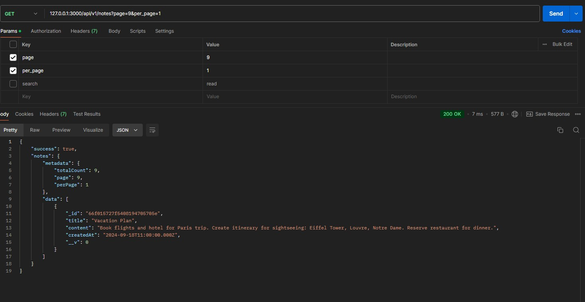
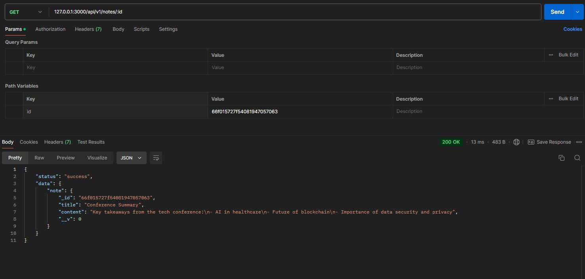
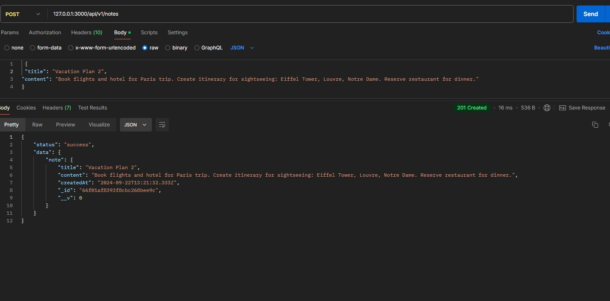
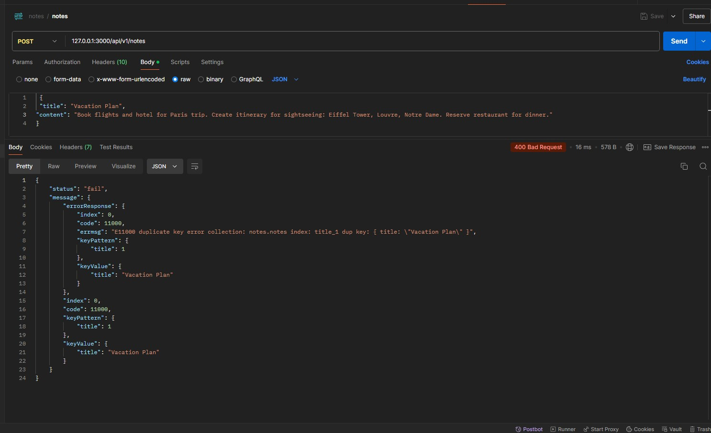
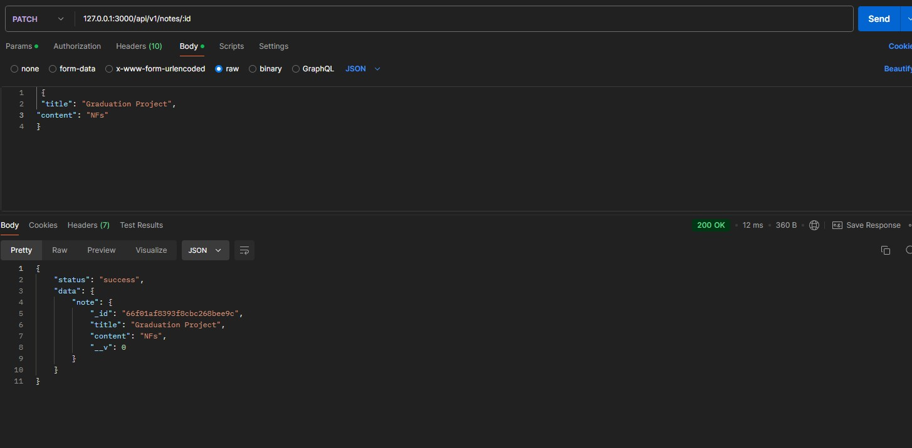
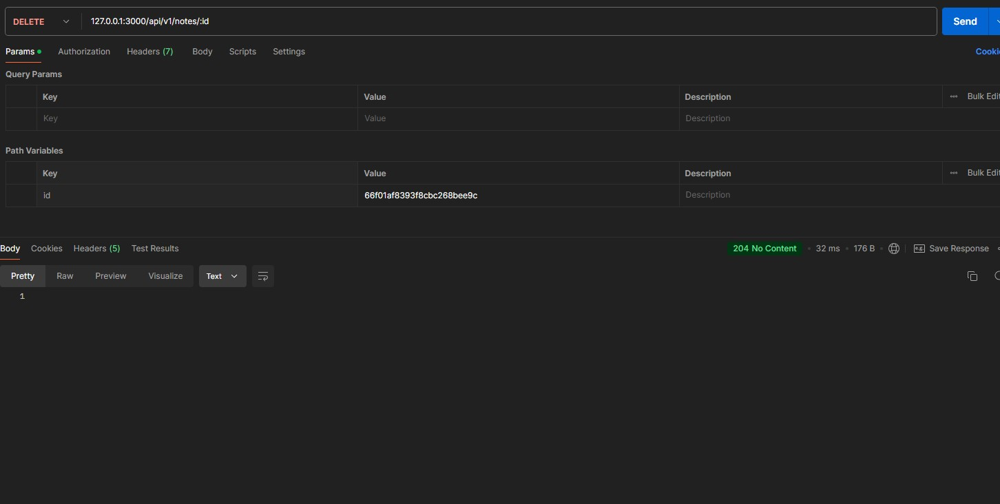

# My Note Keeper API

## Overview

My Note Keeper API is a simple and efficient note management system built with Node.js, Express, and MongoDB. It allows users to perform CRUD operations on their notes, with features like search, pagination.
## Setup Instructions
### 1. Install Dependencies
Before running the API, ensure that all dependencies are installed:
```
npm install
```
### 2. Database set up
You need to run MongoDB locally on your machine. Ensure that MongoDB is properly installed and running
```
mongod
```
Keep the mongod process running in the background while you're using the API.
### 3. Load Test Data
To load sample data for testing purposes, run the following command:
```
node dev-data/data/import-dev-data.js import
```
### 4. Delete All Data

If you want to clear all data from the database, use this command:
```
node dev-data/data/import-dev-data.js delete
```
## API Endpoints
| Method | Endpoint       | Description                           | Query Params      | Body Params                   |
|--------|----------------|---------------------------------------|------------------|-------------------------------|
| GET    | /api/notes      | Retrieve all notes (with pagination)  | `page`, `per_page`, `search` | N/A                           |
| GET    | /api/notes/:id  | Retrieve a specific note by ID        | N/A              | N/A                           |
| POST   | /api/notes      | Create a new note                     | N/A              | `title`, `content`, `createdAt`    |
| PATCH  | /api/notes/:id  | Update an existing note by ID         | N/A              | `title`, `content`, `createdAt`    |
| DELETE | /api/notes/:id  | Delete a specific note by ID          | N/A              | N/A                           |
### Details on Query Params:
- **`page`**: The page number for pagination (default is 1).
- **`per_page`**: The number of notes per page (default is 20).
- **`search`**: A string to search through the note's title and content (case-insensitive and space-insensitive).
### Body Params:
- **`title`**: The title of the note (string, required).
- **`content`**: The content of the note (string, required).

 alt="search-a-note"/>






